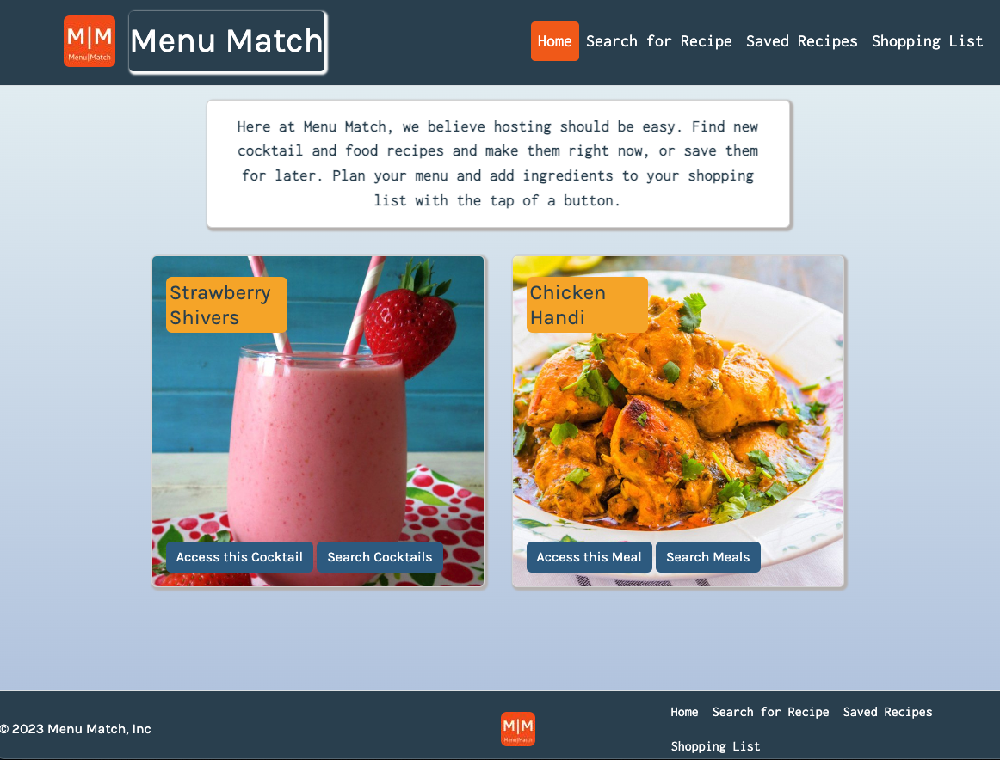
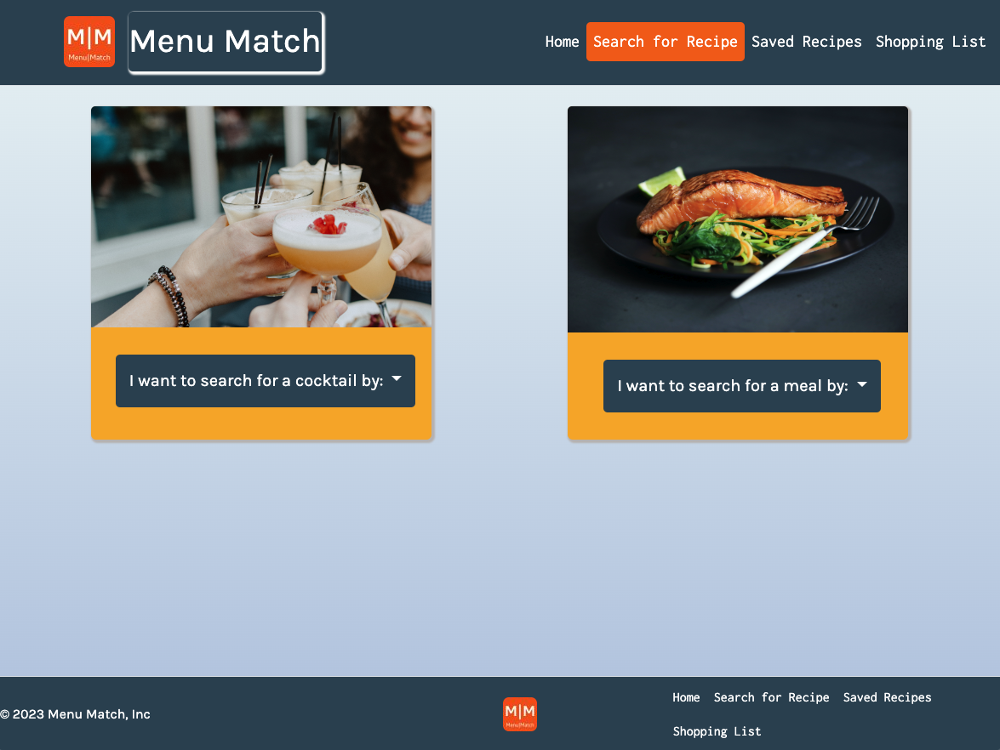
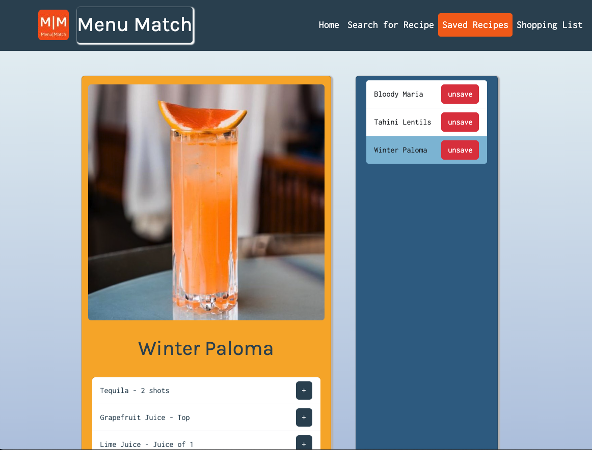
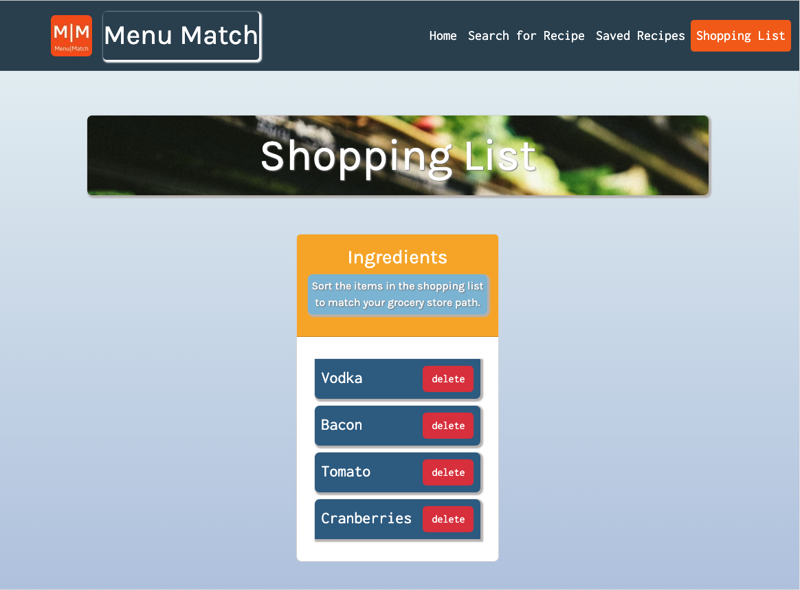

# Menu-Match 👨‍🍳  

## Description 

Hosts, DIY chefs, and home bartenders alike know the struggle of coming up with a meal to cook for themselves or a cocktail to impress their guests. Menu Match is designed to streamline the process of finding a recipe, shopping for ingredients, and preparing a great meal. 

___________________________________________________________________________

📐Some of the technical features on the Menu Match application include: 

🍊 A landing page that features a random cocktail and meal, for those nights when you just can't decide what to make.

🍊 A search page that allows you to search cocktails or meals by name or ingredient. 

🍊 Display and manage a list of saved recipes. Items displayed on the recipe card can be saved to the shopping list. 

🍊 A shopping list that allows the user to sort items in the list to match their grocery store path. Items can be deleted from the list once they are put in the user's cart.

🍊 jQuery was used to make all API calls to Meal DB and CocktailDB.

___________________________________________________________________________

🎨 Some notes on the design:

🥂 We used Bootstrap for our nav bar, footer, and display and recipe cards. 

🥂 The grid system is used on every page to ensure maximum mobile responsiveness.

🥂 A custom color palette was created in coolors.io with blue's to give the user a calming aesthetic (after all, hosting can be stressful sometimes). We also incorporated the warm orange and yellow for small elements and the logo to add dimension and excitement to the pages. 

🥂 Karla is used a header font for simplicity and readability. Inconsolata is used for body items such as ingredients, and shopping list items. The monospace is a nod to vintage recipe cards and cookbooks. 

## Access 🔗 

To access Menu Match on desktop or mobile, use this link: [Menu Match](https://jkellogg01.github.io/menu-match/)

## Installation 💻

For users new to GitHub, follow the git clone process to copy the code into your local repository. 

## Usage 📸

## Credit 

This project was created with love by, [Jordan Adams](https://github.com/JMADA257), [Lillian Edwards](https://github.com/lillianedwards), [Joshua Kellogg](https://github.com/jkellogg01), and [Steven Rodriguez](https://github.com/StevenRodriguezDev). <3

We used [MealDB](https://www.themealdb.com/) and [CocktailDB](https://www.thecocktaildb.com/) to access their databases. 

## License 

Copyright 2023 Jordan Adams, Lillian Edwards, Joshua Kellogg, Steven Rodriguez

Permission is hereby granted, free of charge, to any person obtaining a copy of this software and associated documentation files (the “Software”), to deal in the Software without restriction, including without limitation the rights to use, copy, modify, merge, publish, distribute, sublicense, and/or sell copies of the Software, and to permit persons to whom the Software is furnished to do so, subject to the following conditions:

The above copyright notice and this permission notice shall be included in all copies or substantial portions of the Software.

THE SOFTWARE IS PROVIDED “AS IS”, WITHOUT WARRANTY OF ANY KIND, EXPRESS OR IMPLIED, INCLUDING BUT NOT LIMITED TO THE WARRANTIES OF MERCHANTABILITY, FITNESS FOR A PARTICULAR PURPOSE AND NONINFRINGEMENT. IN NO EVENT SHALL THE AUTHORS OR COPYRIGHT HOLDERS BE LIABLE FOR ANY CLAIM, DAMAGES OR OTHER LIABILITY, WHETHER IN AN ACTION OF CONTRACT, TORT OR OTHERWISE, ARISING FROM, OUT OF OR IN CONNECTION WITH THE SOFTWARE OR THE USE OR OTHER DEALINGS IN THE SOFTWARE.

